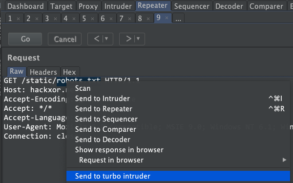
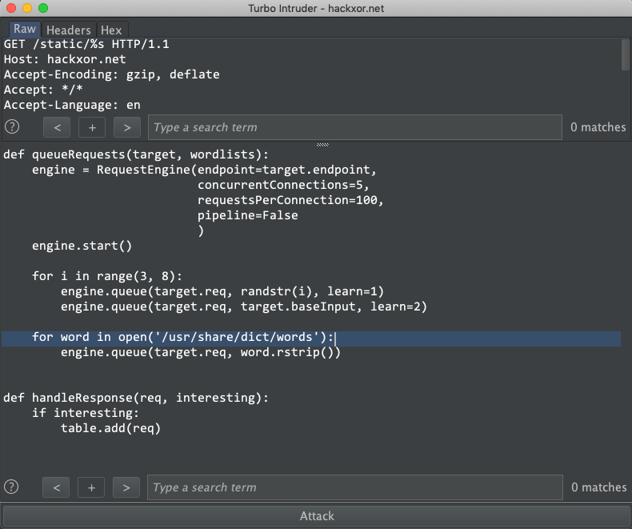

# Turbo Intruder

Turbo Intruder is a Burp Suite extension for sending large numbers of HTTP requests and analyzing the results. It's intended to complement Burp Intruder by handling attacks that require exceptional speed, duration, or complexity. The following features set it apart:

- **Fast** - Turbo Intruder uses a HTTP stack hand-coded from scratch with speed in mind. As a result, on many targets it can seriously outpace even fashionable asynchronous Go scripts.
- **Scalable** - Turbo Intruder can achieve flat memory usage, enabling reliable multi-day attacks. It can also be run in headless environments via the command line.
- **Flexible** - Attacks are configured using Python. This enables handling of complex requirements such as signed requests and multi-step attack sequences. Also, the custom HTTP stack means it can handle malformed requests that break other libraries.
- **Convenient** - Boring results can be automatically filtered out by an advanced diffing algorithm adapted from Backslash Powered Scanner. This means you can launch an attack and obtain useful results in two clicks.

On the other hand it's undeniably harder to use, and the network stack isn't as reliable and battle-tested as core Burp's. As this is a tool for advanced users only I am not going to provide personal support to anyone having trouble using it. Also I should mention it's designed for sending lots of requests to a single host. If you want to send a single request to a lot of hosts, I recommend ZGrab.

#### Getting started

Install Turbo Intruder into Burp Suite using the BApp Store under the Extender tab.

To use it, simply highlight the area you want to inject over, then right click and 'Send to Turbo Intruder'



This will open a window containing a Python snippet looking something like this:



You can customise this code depending on what you want to achieve with your attack.

#### Basic use

You'll notice that the area of the request that you highlighted has been replaced with '%s' - this is where your payloads will be placed.

To begin with you'll probably just want to change '/usr/share/dict/words' to a more suitable wordlist. Other than that the default script should work out of the box for simple use cases.

#### Filtering boring results

In Turbo Intruder, responses don't get placed in the results table automatically. Instead, the 'handleResponse' function is called, in which you can decide whether to add the response to the table. Here's a simple example:
```
def handleResponse(req, interesting):
    if '200 OK' in req.response:
        table.add(req)
````

Coding a custom response check here isn't always necessary - if you queue a requests specify the 'learn' parameter then Turbo Intruder will learn those responses as boring, and then set the 'interesting' argument based on whether each new response looks like a boring one. This strategy is used by the [default script](examples/default.py). For further information on this filtering strategy, check out [blah](https://www.youtube.com/watch?v=EPmjl7q1-n4&list=PLuUtcRxSUZUpv2An-RNhjuZSJ5fjY7ghe&index=3)

#### Speed tuning

If speed is important for your attack, you'll want to tune the `pipeline`, `requestsPerConnection`, and `concurrentConnections` arguments, probably in that order. Your goal should be to find values that maximise the RPS (Requests Per Second) value, while keep the Retries counter close to 0. The optimum values here are highly server dependent, but the max speed I've achieved to a remote server so far is 30,000 RPS.

#### Finding race conditions

The default script uses a streaming attack style, which is great for minimising memory usage but not ideal for finding race conditions. To find a race condition you'll want to ensure all your requests hit the target in as small a window as possible, which can be done by queueing all your requests before starting the request engine. You can find an example at [examples/race.py](/examples/race.py)

#### Builtin wordlists

Turbo Intruder has two builtin wordlists - one for launching long-running bruteforce attacks, and one containing all words observed in in-scope proxy traffic. The latter wordlist can lead to some quite interesting findings that would normally require manual testing to identify. You can see how to use each of these in [specialWordlists.py](/examples/specialWordlists.py)

#### Command line usage

From time to time, you might find you want to run Turbo Intruder from a server. To support headless use it can be launched directly from the jar, without Burp.

You can grab the jar from the releases pane.

You'll probably find it easiest to develop your script inside Burp as usual, then save and launch it on the server like so:

`java -jar turbo.jar <scriptFile> <baseRequestFile> <endpoint> <baseInput>`

Example: `java -jar turbo.jar examples/basic.py examples/request.txt https://example.net:443 foo`

The command line support is pretty basic - if you try to use this exclusively you'll probably have a bad time. Also, it doesn't support automatic interesting response detection as this relies on various Burp methods.